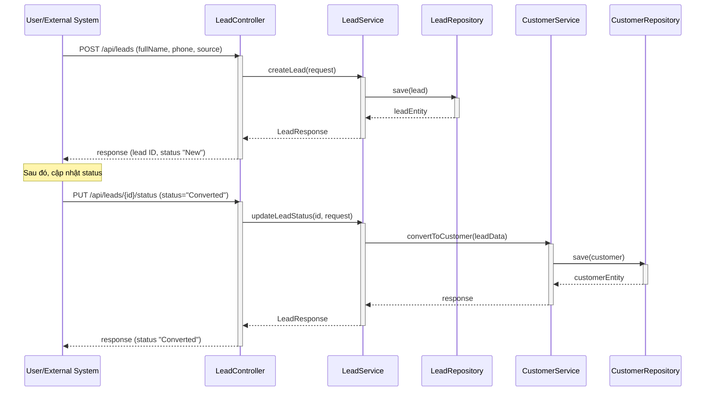
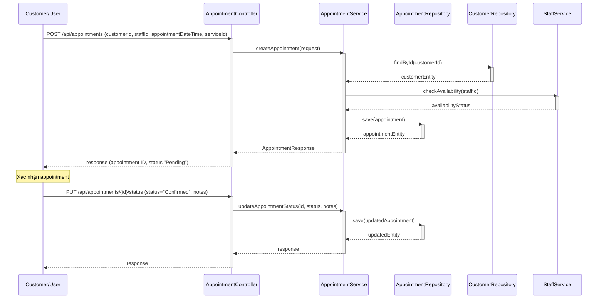
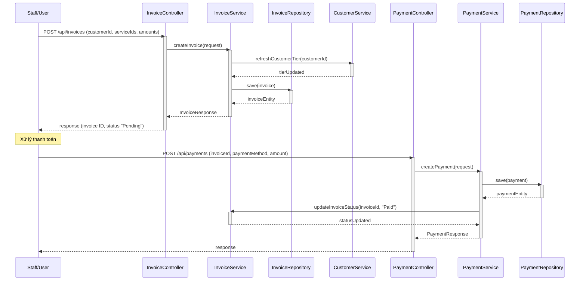
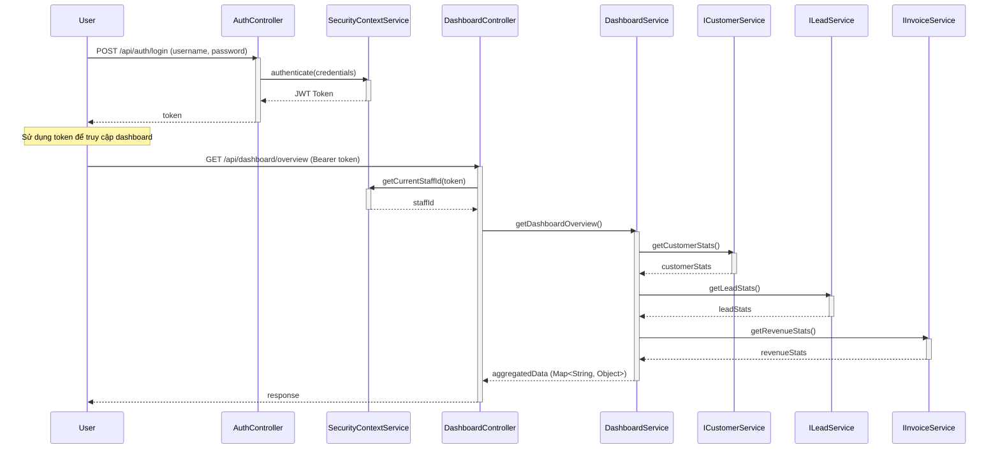
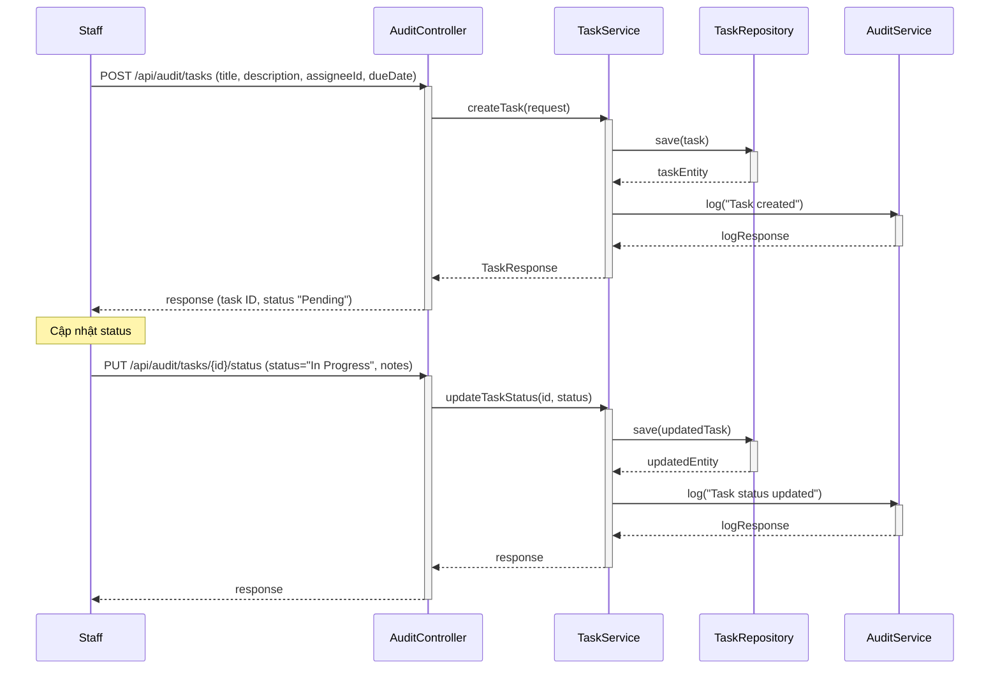

# Sequence Diagrams for CRM Module

Dưới đây là 5 sequence diagram mô tả các luồng chính trong hệ thống CRM. Các sơ đồ được viết bằng Mermaid và có thể render trực tiếp trên GitHub hoặc công cụ hỗ trợ Mermaid (như VS Code extensions). Bạn có thể copy code Mermaid vào trình soạn thảo để xem.

## 1. Tạo Lead và Chuyển đổi thành Customer


## 2. Đặt và Xác nhận Lịch hẹn


## 3. Tạo Hóa đơn và Thanh toán


## 4. Đăng nhập và Lấy Dữ liệu Dashboard


## 5. Tạo và Cập nhật Task trong Audit


### Hướng dẫn sử dụng:
- **Render trên GitHub:** GitHub tự động render Mermaid nếu bạn dùng fenced code blocks như ```mermaid.
- **Công cụ khác:** Copy code vào Mermaid editor (mermaid.live), VS Code với extension Mermaid, hoặc diagrams.net (import từ Mermaid).
- **Tùy chỉnh:** Nếu cần thêm details (e.g., alt fragments cho errors), cho tôi biết để update!

Nếu bạn muốn file riêng cho từng diagram hoặc chỉnh sửa, cứ nói nhé! 😊
