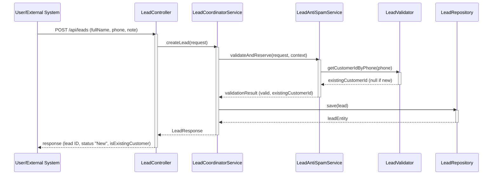
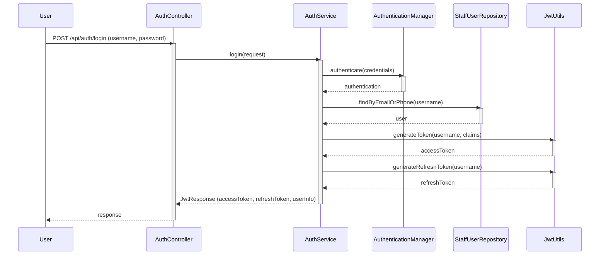
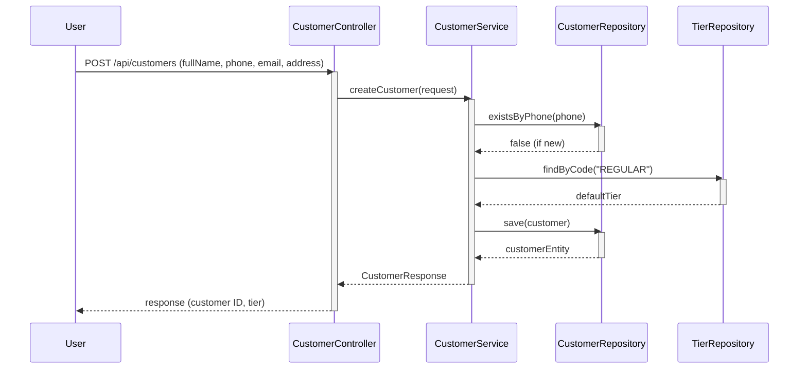
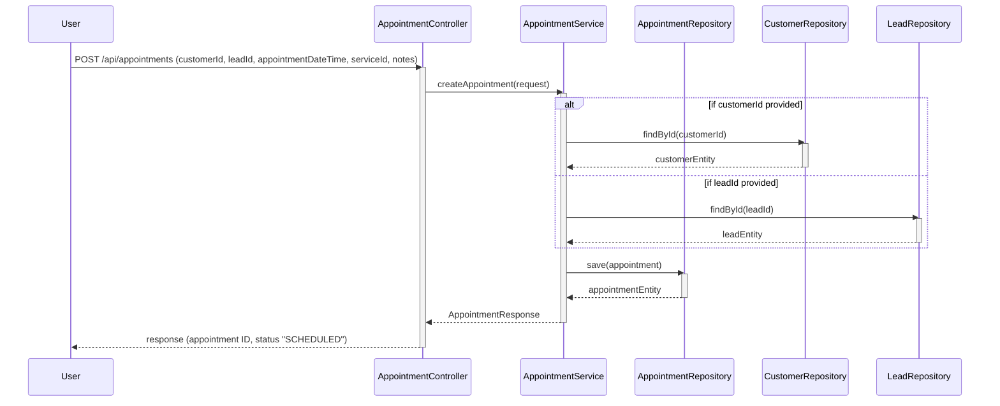
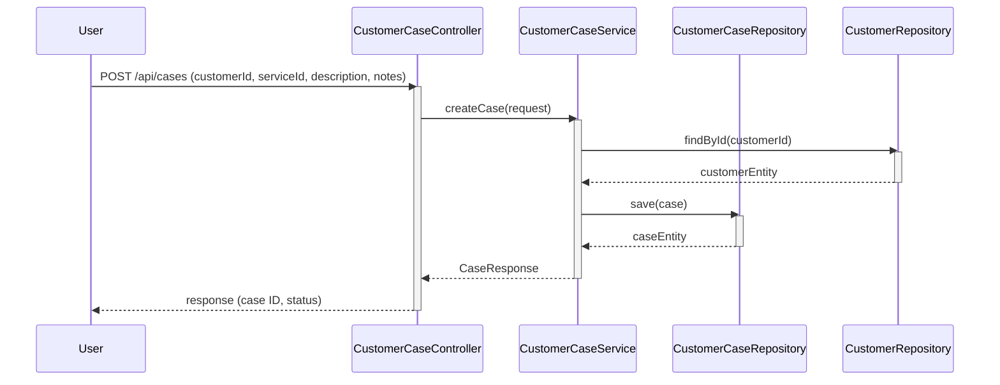
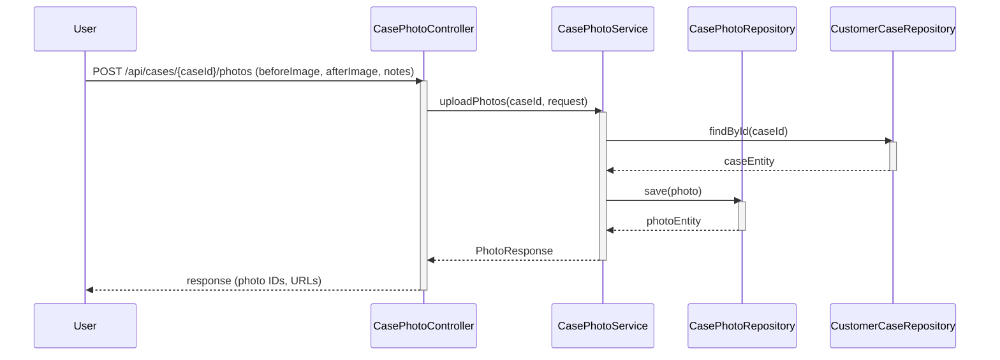
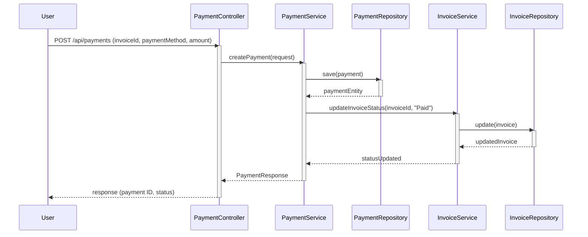

# Sequence Diagrams for CRM Module

Dưới đây là các sequence diagram mô tả các luồng chính trong hệ thống CRM, dựa trên source code thực tế. Các sơ đồ được viết bằng Mermaid và có thể render trực tiếp trên GitHub hoặc công cụ hỗ trợ Mermaid. Tôi đã xóa các sơ đồ cũ và tạo lại dựa trên luồng chính xác từ source BE.

## 1. Tạo Lead (Public API, Check SĐT để xác định khách cũ/mới)


## 2. Đăng nhập sinh Token


## 3. Tạo Khách hàng


## 4. Tạo Lịch hẹn


## 5. Tạo Hồ sơ Điều trị (Customer Case)


## 6. Upload Ảnh Trước Sau (Case Photos)


## 7. Thanh toán


### Hướng dẫn sử dụng:
- **Render trên GitHub:** GitHub tự động render Mermaid nếu bạn dùng fenced code blocks như ```mermaid.
- **Công cụ khác:** Copy code vào Mermaid editor (mermaid.live), VS Code với extension Mermaid, hoặc diagrams.net (import từ Mermaid).
- **Tùy chỉnh:** Nếu cần thêm details (e.g., alt fragments cho errors), cho tôi biết để update!

Nếu bạn muốn file riêng cho từng diagram hoặc chỉnh sửa, cứ nói nhé! 😊
